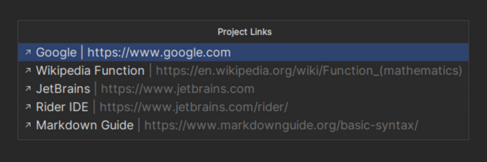
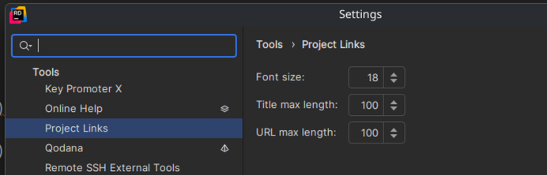

# [JetBrains Plugin: Project Links 🖇️](https://plugins.jetbrains.com/plugin/27887-projectlinks)

This plugin will find markdown links in the README.md file, at the root of the current project, and display them in a tool window.

The tool window is fuzzy searchable. Selecting an entry will open the link in the default browser.

## Demo

## Settings

The following settings are available in the plugin:

### Overview

| Setting          | Description                                    | Default   |
|------------------|------------------------------------------------|-----------|
| Link Font Size   | The font size of the links in the tool window. | 16  px    |
| Title Max Length | The title will be truncated to this length.    | 100 chars |
| Url Max Length   | The URL will be truncated to this length.      | 50  chars |

### TODO

- [TODO - Add Support for github button links](https://gist.github.com/tterb/1e12ddb9af04931e8e5ba634778b283c)
- Add entry to open README.md
- Add support for non MD formatted links(with setting)
- File Paths(with setting)
- Add Tests
